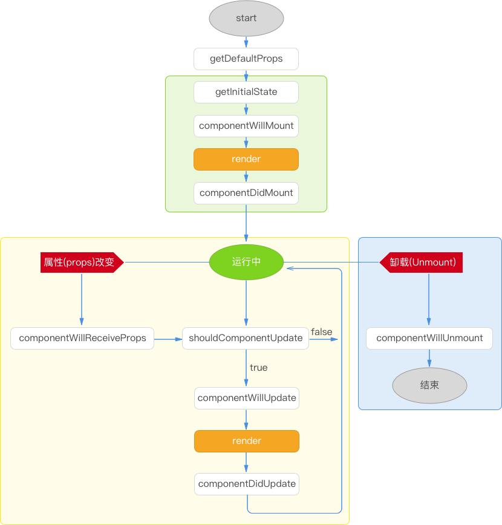

# React Native 中组件的生命周期

我们先简单的看下RN的生命周期图。



周期大致分为3个阶段

## 组件加载

### ComponentWillMount()

componentWillMount 会在组件 render 之前执行,并且永远都只执行一次.

由于这个方法只执行一次的缘故,所以在这里如果定义了 setState 方法,页面会在加载前更新一次.

### ComponentDidMount()

这个方法会在组件加载完毕之后立即执行.这个时候组件已经生成了对应的 DOM 结构.可以通过 this.getDOMNode() 来访问.


## 组件更新

### ComponentWillReceiveProps(object nextProps)

在组件接收到一个新的 prop 时被执行.这个方法在初始化 render 时不会被调用.

旧的 props 可以通过 this.props 来获取.在这个函数内调用 this.setState() 方法不会增加一次新的 render.

```javascript
componentWillReceiveProps: function(nextProps) {
  this.setState({
    likesIncreasing: nextProps.likeCount > this.props.likeCount
  })
}
```

### ShouldComponentUpdate

```javascript
boolean shouldComponentUpdate(object nextProps, object nextState)
```

返回一个布尔值.在组件接收到新的props或者state时被执行.在初始化时或者使用forceUpdate时不被执行.

可以在你确认不需要更新组件时使用

```javascript
shouldComponentUpdate: function(nextProps, nextState) {
  return nextProps.id !== this.props.id
}
```

如果 shouldComponentUpdate 返回 false, render() 则会在下一个 state change 之前被完全跳过.(另外 componentWillUpdate 和 componentDidUpdate 也不会被执行)

默认, shouldComponentUpdate 会返回 true.

By default, shouldComponentUpdate always returns true to prevent subtle bugs when state is mutated in place, but if you are careful to always treat state as immutable and to read only from props and state in render() then you can override shouldComponentUpdate with an implementation that compares the old props and state to their replacements.

如果你需要考虑性能,特别是在有上百个组件时,可以使用 shouldComponentWillUpdate 来提升应用速度.


### componentWillUpdate

```
componentWillUpdate(object nextProps, object nextState)
```

在组件接收到新的 props 或者 state 但还没有 render 时被执行.在初始化时不会被执行.

一般用在组件发生更新之前.


### componentDidUpdate

```
componentDidUpdate(object prevProps, object prevState)
```

在组件完成更新后立即执行,在初始化时不会被执行.一般会在组件完成更新后被使用.


## Unmounting

### componentWillUnmount

在组件从DOM unmount 后立即执行.

```
componentDidMount: function() {
  this.inc = setInterval(this.update, 500)
},
componentWillUnmount: function() {
  console.log('goodbye cruel world!')
  clearInterval(this.inc)
}
```

主要用来执行一些必要的清理任务,例如清除 setTimeout 等函数,或者任意的在 componentDidMount 创建的 DOM 元素.

## 参考

http://www.reactnativeexpress.com/lifecycle_api

http://busypeoples.github.io/post/react-component-lifecycle/

https://reactjs.org/docs/react-component.html

https://fraserxu.me/2014/08/31/react-component-lifecycle/

https://www.race604.com/react-native-component-lifecycle/