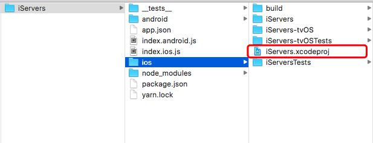
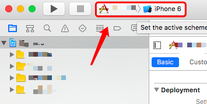
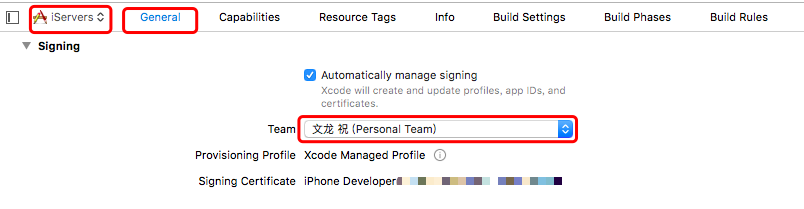
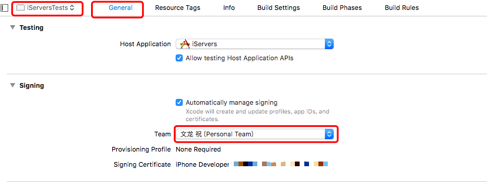

# React Native 设备上运行调试

## IOS 设备使用之法

#### 注册苹果开发者帐号

开发者帐号,是帮助你在开发运行在设备时需要使用.

申请地址: [苹果开发者帐号](https://developer.apple.com/)


#### 生成项目

```shell
react-native init yourProject
cd yourProject
react-native run-ios
```

具体操作可以参考**[官方文档](https://facebook.github.io/react-native/docs/getting-started.html)**


#### 运行 xcode

在你的项目中,找到 **ios/yourProject.xcodeproj** 文件,双击打开




#### 连接设备

将你的设备和电脑用USB连接起来,注意,这时要保证网络在同一个wifi的环境之下.

1. ##### 然后选择你的设备,切换好你的设备



##### 2. 注册团队

注册团队和开发者,在设备上使用时,需要这些,这时正好用到开头的注册帐号了

2.1 选择项目的 Signing



2.2 选择测试的 Signing



这里我都使用的是我自己个人的,大家可以选择团队或公司的!网上有人说使用icloud帐号说没行,没测试过!!


### 运行

都完成之后,我们可以运行了!

点击如左上角的开始图标,等待编译安装就可以使用了!


#### 手机注意事项

首次安装之后,手机可能无法运行,此时你可以手动点击运行,如果提示你在设置中设置,

你可以按:

**设置 > 通用 > 设备管理 > 开发者应用(选择你的开发者号) **

然后同意就好!


#### 其它

1. 晃动手机,可以呼出调试菜单!
2. 如果发现手机连不上xcode,拔了,关xcode,再试试几次