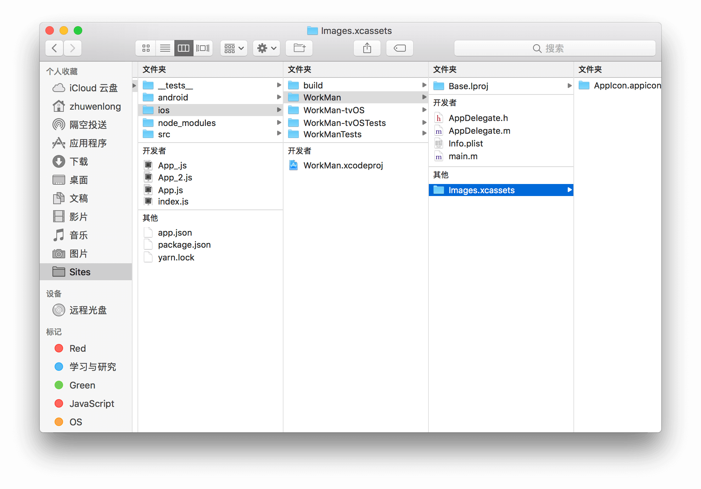

# IOS 图标

ios图标通常放在如下位置:

这里推荐2个网站方便大家生成 ios 与 android 图标.

**http://icon.wuruihong.com/** 国内的,使用起来比较方便.

**http://ticons.fokkezb.nl/** 这是一个国外的网站,生成的图片比较完整也比较丰富.

## 参考

https://zhuanlan.zhihu.com/p/29495955