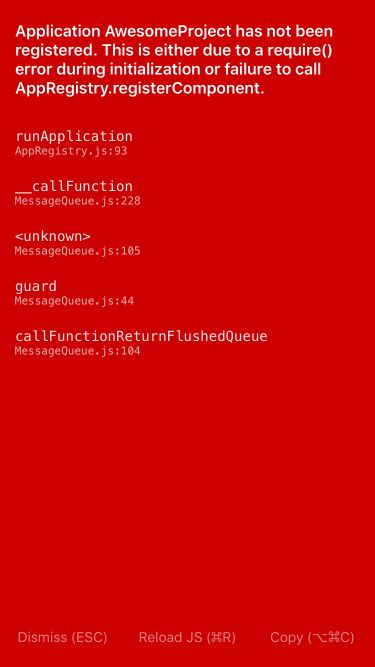

# React Native 错误整理

## Application AwesomeProject has not been registered.



**错误原因:** 在我们的 `./index.ios.js` 文件中

```jsx
AppRegistry.registerComponent('项目名称', ()=> ... )
```

这里的项目名称与 `./ios/项目名称/appDelegate.m` 中的

```objective-c
RCTRootView *rootView = [[RCTRootView alloc] initWithBundleURL:jsCodeLocation
  moduleName:@"项目名称"
```

或是 `./android/app/src/main/java/com/项目名称/MainActivity.java` 中的

```java
@Override
    protected String getMainComponentName() {
        return "项目名称";
    }
```

没有保持一致,解决方法就是修改成一样就可以了.

#### 方法二: 

- 删除项目中的 android 和 ios 文件

- 修改 package.json 中的 name

- 重新编译项目

  ```sh
  node -e "require('react-native/local-cli/cli').init('.','项目名称')"
  ```

- 运行

  ```sh
  react-native run-ios
  ```

  ​

# react-native-vector-icons 相关问题

### Unrecognized font family 'Ionicos'

1. close running packager
2. run react-native link react-native-vector-icons
3. and run react-native start --reset-cache
4. Finally use react-native run-ios


### react-native-vector-icons删除后导致无法生成

在删除后,因字体还在引用,导致生成无法成功,我们可以删除 **./ios/build/** ,然后运行 **react-native upgrade** 如果你同时想要升级,可以一路 **y** ,最后运行 **react-native run-ios**

1. react-native upgrade
2. react-native run-ios